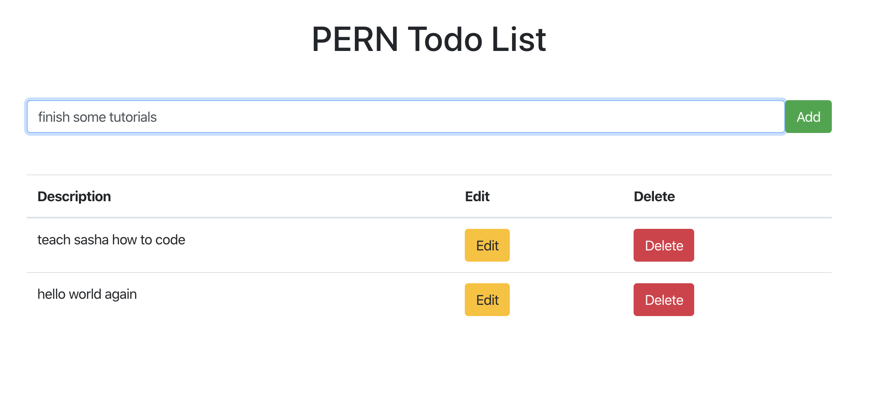
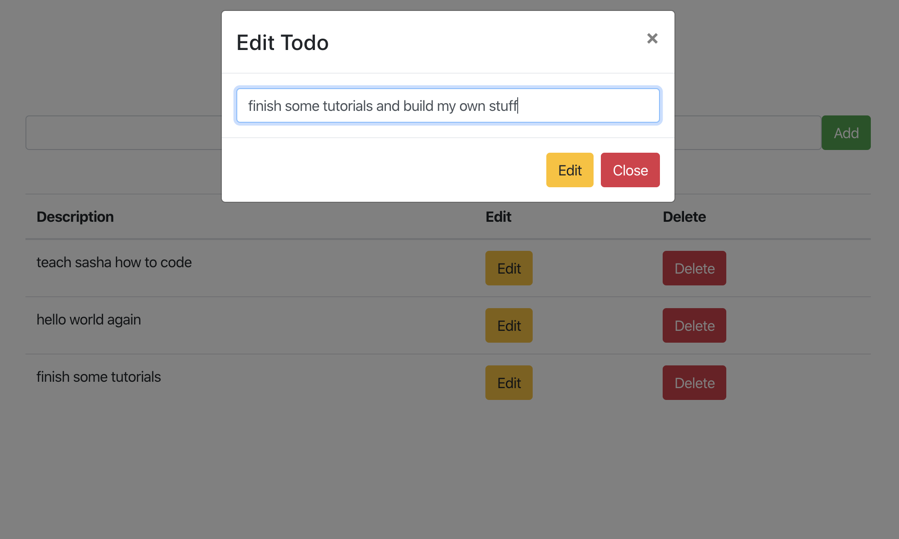

# pern-todo-app
Todo Webapp using a PERN stack: Postgresql, Express, React, NodeJS

# Why did I do this?

After reviewing the weekly "5 Links Worth Your Time" by Quincy Larson of freecodecamp.org, and being quarantined on a sunny Saturday morning, I wanted to see how to link Postgresql, a database technology I'm familiar with, to a NodeJS backend, and get some more practice with React. My previous experiences working with Postgresql were only with a Java backend and, while going through the Web Developer Bootcamp by Colt Steele and getting exposed to NodeJS with MongoDB and EJS, I thought it'd be interesting to find out how to strap a NodeJS app with a relational database rather than a non-relational one. 

# What did I learn? 

 * How to use `async` and `await` methods to fetch data from the backend and wait for the response to come in. 
 * How easy to is to connect postgres to an express app! See `db.js`
 * How to use `fetch` to send requests (so much easier than in Java). 
 * A better understanding of React Hooks and general scope of code within component files.
 
 # What's cool about this app?
 
Contrary to what's happening in the Web Development Bootcamp, the frontend and backend are completely separated, so we could use a completely new frontend and send requests to the backend api without having to touch the backend at all.

# Some pictures

